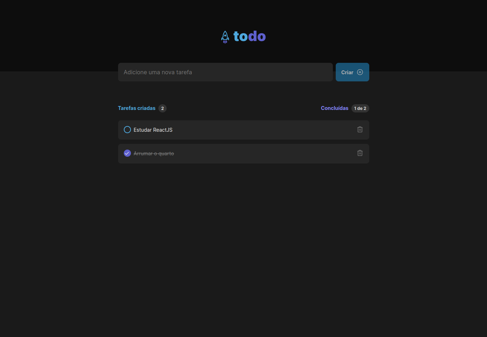
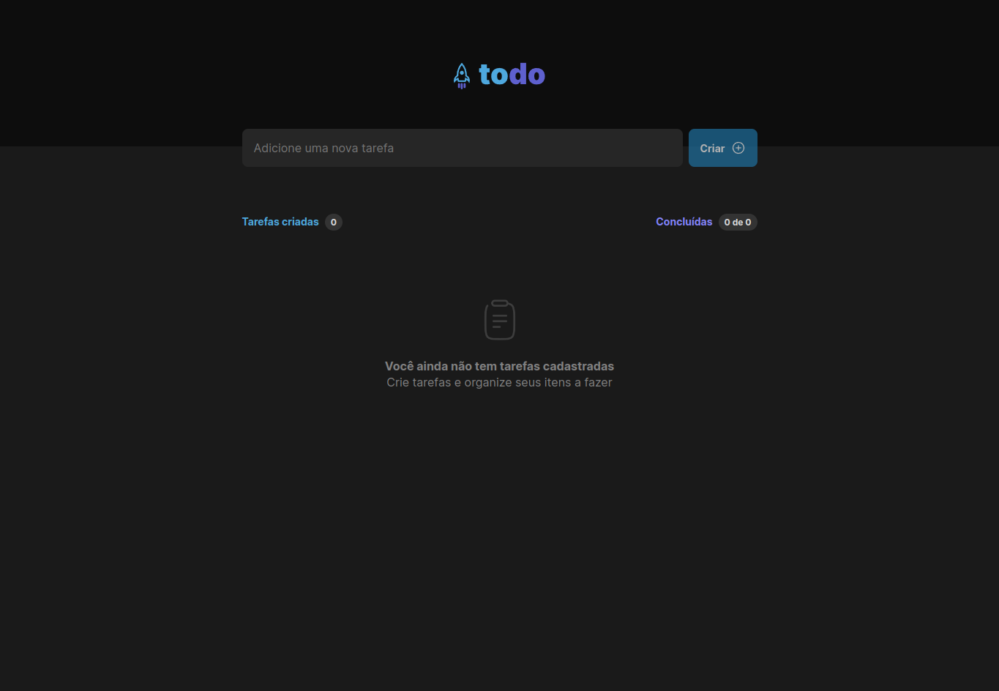

<div align="center">
  
</div>

<div align="center">
  <h2 style='display: block'>ToDo list is a web application to create and control tasks.</h2>
</div>

## Techs

<ul>
  <li>
    <strong>ReactJS </strong>
  </li>
  <li>
    <strong>TypeScript</strong>
  </li>
  <li>
    <strong>Vite </strong>
  </li>
  <li>
    <strong>CSS Modules </strong>
  </li>
</ul>


## Project

### Clone project

```bash
$ git clone https://github.com/ngustavo80/toDo-list.git
```  

### Instalar dependências

  ```bash
$ npm i
```

## Screenshots



